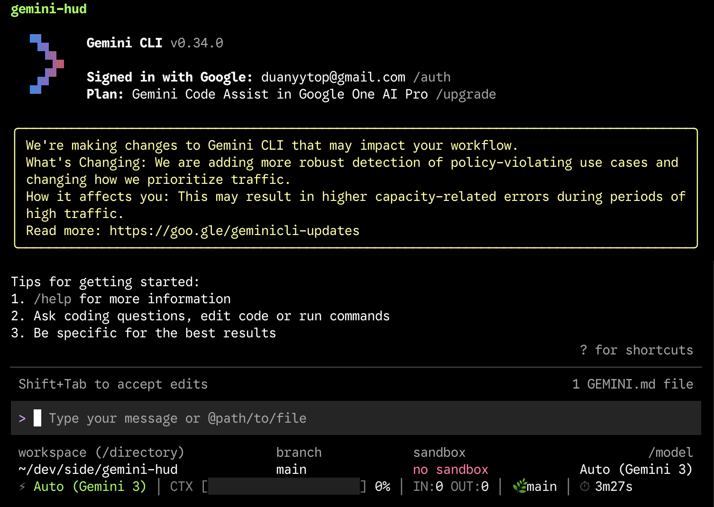

# gemini-hud

将 HUD 状态栏直接嵌入 Gemini CLI 的 footer 区域 — 无需额外面板，无需 tmux。

通过 Node.js ESM Loader Hook 在运行时拦截并增强 Gemini CLI 的 Footer 组件。



## 前置要求

- **Node.js** >= 20
- **Gemini CLI** >= 0.34.0（`npm install -g @google/gemini-cli`）

## 安装

```bash
npm install -g gemini-hud
```

## 使用

```bash
gemini-hud          # 启动带 HUD 的 gemini
gemini-hud --help   # 参数直接传递给 gemini
```

或手动运行（路径按实际安装位置替换）：

```bash
node --import ./register.mjs $(which gemini)
```

## 配置

创建 `~/.gemini-hudrc`（JSON 格式）：

```json
{
  "colors": {
    "label": "gray",
    "value": "white",
    "separator": "gray",
    "warning": "yellow",
    "danger": "red"
  },
  "contextMaxTokens": 1000000,
  "showSessionDuration": true,
  "showTokenBreakdown": true,
  "showToolCalls": true
}
```

所有字段均为可选，未指定的使用默认值。

## 工作原理

1. **`register.mjs`** — 通过 `node:module.register()` 注册 ESM loader hook
2. **`loader.mjs`** — 拦截 `resolve` 阶段；当检测到 `@google/gemini-cli` 的 `Footer.js` 被加载时，重定向到我们的 `hud-footer.mjs`
3. **`hud-footer.mjs`** — 渲染原始 Footer（保留所有原有功能），并在下方追加 HUD 信息行
4. **`bin/gemini-hud`** — 跨平台启动脚本：`node --import register.mjs $(which gemini) "$@"`

## 数据来源

| 信息 | 来源 |
|------|------|
| 上下文用量 | `uiState.sessionStats.lastPromptTokenCount`（通过 Footer props） |
| Token 分项 | `~/.gemini/tmp/<project>/chats/session-*.json` |
| 工具调用 | Session JSON `messages[].parts[].functionCall` |
| 会话时长 | 组件挂载时启动计时器 |

## 兼容性

- **Node.js**: >= 20（需要 ESM loader hooks 支持）
- **Gemini CLI**: >= 0.34.0（使用 column 布局的 Footer 及 `FooterRow`）
- **平台**: macOS、Linux、Windows
- **Gemini CLI 更新适配**: 若 `Footer.js` 路径变更，只需修改 `loader.mjs` 中的 `FOOTER_PATTERN` 正则

## 许可证

MIT
